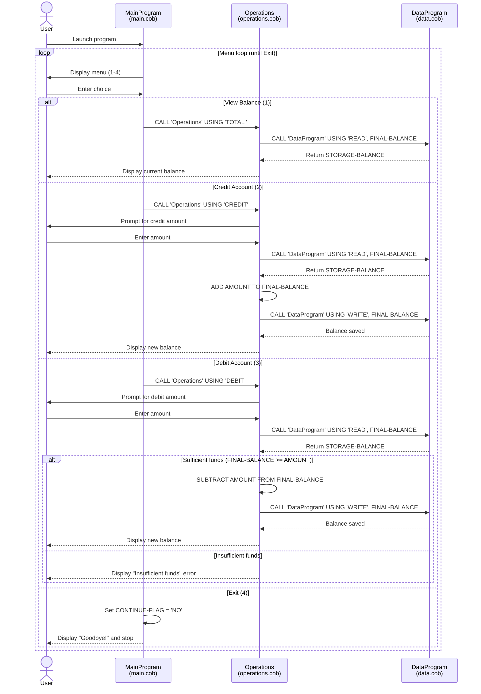

# Student Account Management System — COBOL Documentation

## Overview

This system is a legacy COBOL application that manages student account balances. It provides a menu-driven interface for viewing balances, crediting funds, and debiting funds from a student account.

---

## COBOL Files

### `src/cobol/main.cob`
**Program ID:** `MainProgram`

Entry point of the application. Displays an interactive menu in a loop and routes user input to the appropriate operation.

**Key Logic:**
- Presents a 4-option menu: View Balance, Credit Account, Debit Account, Exit.
- Uses `EVALUATE` to dispatch to the `Operations` program via `CALL 'Operations' USING <operation-type>`.
- Loops until the user selects option 4 (Exit), which sets `CONTINUE-FLAG` to `'NO'`.

**Variables:**
| Variable | Type | Description |
|---|---|---|
| `USER-CHOICE` | `PIC 9` | Stores the menu selection (1–4) |
| `CONTINUE-FLAG` | `PIC X(3)` | Controls the main loop (`YES`/`NO`) |

---

### `src/cobol/operations.cob`
**Program ID:** `Operations`

Handles all account operations. Called by `MainProgram` with a 6-character operation code.

**Key Functions:**
| Operation Code | Description |
|---|---|
| `TOTAL ` | Reads and displays the current balance |
| `CREDIT` | Prompts for an amount, reads balance, adds amount, writes updated balance |
| `DEBIT ` | Prompts for an amount, checks for sufficient funds, subtracts amount, writes updated balance |

**Business Rules:**
- A debit is only allowed if `FINAL-BALANCE >= AMOUNT`. If funds are insufficient, the transaction is rejected with the message `"Insufficient funds for this debit."` and the balance is not modified.
- The default/starting balance is `1000.00`.
- All balance interactions go through `DataProgram` via `CALL 'DataProgram' USING <operation> <balance>`.

**Variables:**
| Variable | Type | Description |
|---|---|---|
| `OPERATION-TYPE` | `PIC X(6)` | Local copy of the passed operation code |
| `AMOUNT` | `PIC 9(6)V99` | Amount entered by the user for credit/debit |
| `FINAL-BALANCE` | `PIC 9(6)V99` | Working copy of the account balance |
| `PASSED-OPERATION` | `PIC X(6)` | Linkage parameter — operation code from caller |

---

### `src/cobol/data.cob`
**Program ID:** `DataProgram`

Simulates a data layer for reading and writing the account balance. Acts as an in-memory persistence layer using a working-storage variable.

**Key Functions:**
| Operation Code | Description |
|---|---|
| `READ` | Copies `STORAGE-BALANCE` into the caller's `BALANCE` linkage field |
| `WRITE` | Copies the caller's `BALANCE` linkage field into `STORAGE-BALANCE` |

**Business Rules:**
- The initial balance is hardcoded to `1000.00` in `STORAGE-BALANCE`.
- Balance state is held in working storage and is not persisted to a file or database — it resets each time the program is run.

**Variables:**
| Variable | Type | Description |
|---|---|---|
| `STORAGE-BALANCE` | `PIC 9(6)V99` | In-memory store for the account balance (default: `1000.00`) |
| `OPERATION-TYPE` | `PIC X(6)` | Local copy of the passed operation code |
| `PASSED-OPERATION` | `PIC X(6)` | Linkage parameter — operation code from caller |
| `BALANCE` | `PIC 9(6)V99` | Linkage parameter — balance passed by reference |

---

## Business Rules Summary

| Rule | Location |
|---|---|
| Starting balance is `1000.00` | `data.cob` (`STORAGE-BALANCE`), `operations.cob` (`FINAL-BALANCE`) |
| Debits require sufficient funds | `operations.cob` — `IF FINAL-BALANCE >= AMOUNT` |
| Insufficient funds are rejected silently (no partial debit) | `operations.cob` |
| Balance is not persisted between program runs | `data.cob` — in-memory working storage only |
| Valid menu choices are 1–4; anything else shows an error | `main.cob` — `WHEN OTHER` branch |

---

## Call Hierarchy

```
MainProgram (main.cob)
└── Operations (operations.cob)
    └── DataProgram (data.cob)
```

---

## Data Flow Sequence Diagram


